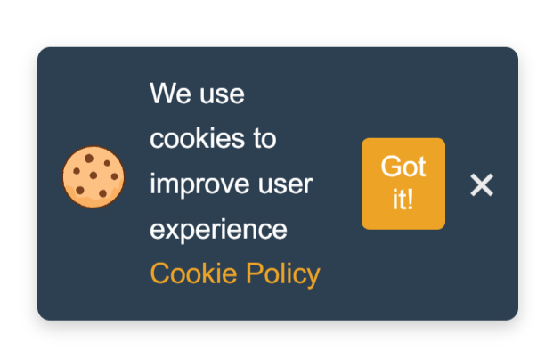

# Cookie Consent

## Goal

Introduce you to basic DOM manipulation and event handling in JavaScript.

https://roadmap.sh/projects/cookie-consent

# Description

Create a simple cookie consent popup that appears when the user visits the page. The popup will include a message and a button to accept the consent. Once accepted, the popup will disappear.

Bonus points if you persist the user’s consent using cookies or local storage and prevent the popup from appearing on subsequent visits.
