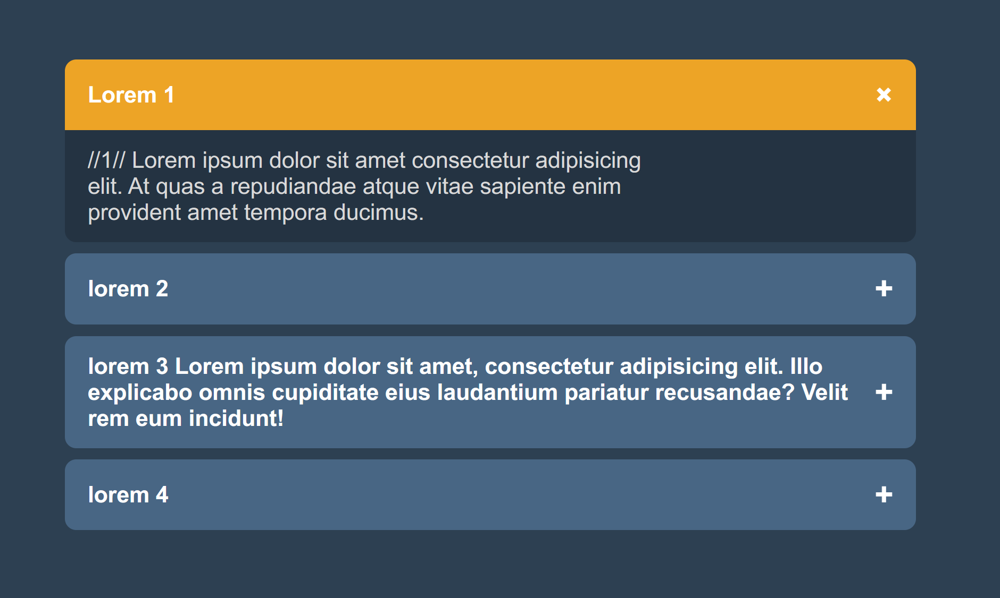

# Restricted Textarea

## Goal

Practice manipulating input elements with JavaScript, handling user input events, and providing real-time feedback to enhance user experience.

https://roadmap.sh/projects/restricted-textarea

# Description

Create a textarea that tracks and displays the number of characters typed by the user, along with a maximum character limit. As the user types, the character count will update dynamically. Once the limit is reached, the textarea will prevent further input and the border will turn red to visually indicate the limit has been hit.
