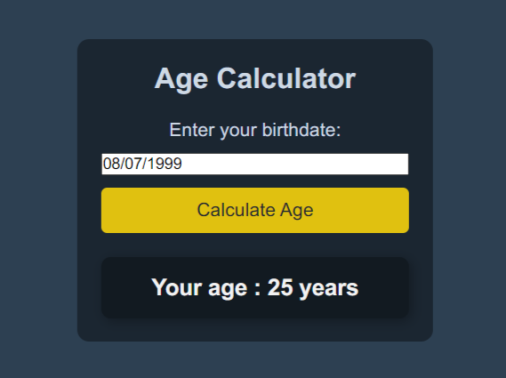

# Age Calculator

## Goal

The goal of this project is to help you learn about how to use external packages using npm. The user inputs their birthdate via a JavaScript Datepicker, and the app calculates and displays their exact age, including years, and months using Luxon.

https://roadmap.sh/projects/age-calculator

# Description

Understand how to manipulate dates and times in JavaScript using Luxon. You’ll gain experience handling user input via a datepicker, performing date calculations, and designing a simple user interface.
