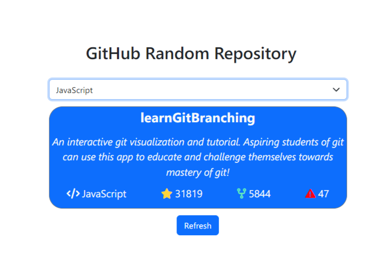

# GitHub Random Repository

## Goal

The goal of this project will help you practice API integration, managing asynchronous data, and enhancing user experience with responsive UI states.

https://roadmap.sh/projects/github-random-repo

# Description

Create a GitHub repository finder that allows users to select a programming language from a dropdown menu. The app will then use the GitHub Repository Search API to fetch and display a random repository that matches the selected language. The displayed information should include the repository name, description, number of stars, forks, and open issues. Users can fetch another random repository with a button click.
