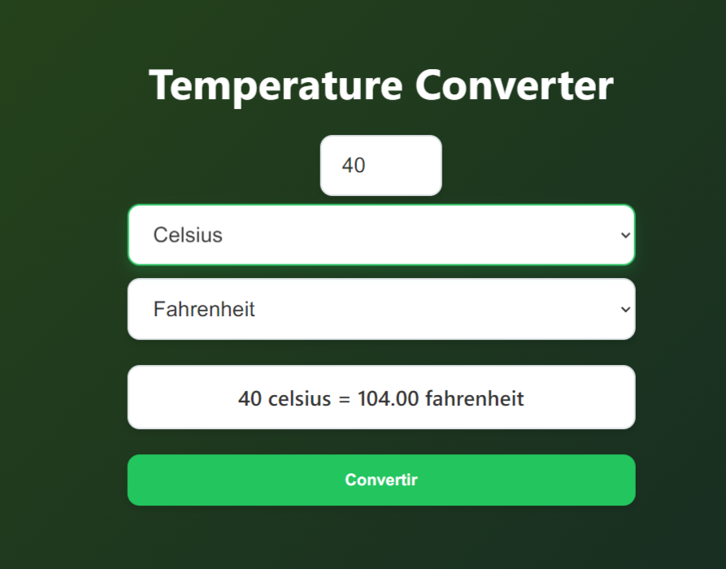

# Temperature Converter

## Goal

The goal of this project is to help you handling user input, conditionally enabling form elements, and performing simple calculations using JavaScript.

https://roadmap.sh/projects/custom-dropdown

# Description

Create a temperature converter that allows users to enter a temperature value, select the unit they want to convert from, and select the unit they want to convert to. The “Convert” button should only be enabled when all three fields are filled in. Once the user clicks “Convert,” the tool will display the converted temperature below the form.
